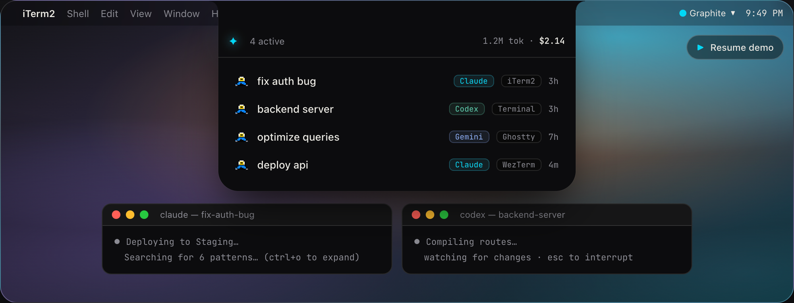
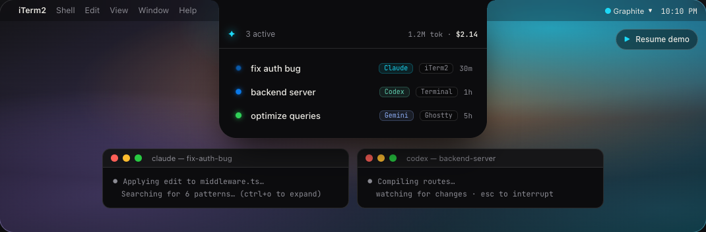

<div align="center">

<!-- PLACEHOLDER: Add a banner image at docs/screenshots/banner.png, then remove this comment -->
<!--  -->

# NotchDeck

**Your MacBook notch, reimagined as an AI agent command deck.**

Monitor multiple AI coding agents at a glance — click to jump to any session instantly.

[](https://www.apple.com/macos/)
[](https://swift.org)
[](LICENSE)
[](https://github.com/navjotdhanawat/notchdeck/stargazers)

</div>

---

## ✨ What is NotchDeck?

NotchDeck is a native macOS app that turns the MacBook Pro notch into a **live status dashboard** for your AI coding agent sessions.

Running 4 parallel Claude Code sessions? Spinning up a Codex CLI job while Claude edits tests? NotchDeck shows every session's state — **working, needs input, needs permission, done, failed** — right in the notch. One click jumps you to the exact terminal pane. No yabai, no cloud, no telemetry.

<!-- Replace with actual app screenshot -->


---

## 🚀 Features

- 🎯 **Glanceable status** — color-coded dots for every live agent session, always visible in the notch
- ⚡ **Click-to-jump** — focus the exact iTerm2 / WezTerm / Kitty pane in one click
- 🤖 **Multi-agent** — supports Claude Code and Codex CLI today; more agents coming
- 💻 **Multi-terminal** — iTerm2, WezTerm, Kitty, and any terminal as fallback
- 💰 **Cost tracking** — live token usage and estimated spend per session
- 🔔 **Completion sound** — subtle chime when a session finishes
- 🎨 **Themes** — dark, light, minimal, vibrant glassmorphism
- 🔒 **100% local** — no accounts, no cloud, no telemetry; HTTP server binds to `127.0.0.1` only
- ⚙️ **Self-configuring** — auto-installs agent hooks on first launch

---

## 📸 Screenshots

<table>
  <tr>
    <td align="center">
      <!-- Replace with actual screenshot -->
      
      <br /><sub><b>Multiple sessions — working</b></sub>
    </td>
    <td align="center">
      <!-- Replace with actual screenshot -->
      
      <br /><sub><b>Session needs permission</b></sub>
    </td>
  </tr>
  <tr>
    <td align="center">
      <!-- Replace with actual screenshot -->
      
      <br /><sub><b>Session completed</b></sub>
    </td>
    <td align="center">
      <!-- Replace with actual screenshot -->
      
      <br /><sub><b>Theme options</b></sub>
    </td>
  </tr>
</table>

---

## 🤖 Supported Agents

| Agent | Status | Cost Tracking |
|-------|--------|--------------|
| [Claude Code](https://claude.ai/code) (Anthropic) | ✅ Supported | ✅ |
| [Codex CLI](https://github.com/openai/codex) (OpenAI) | ✅ Supported | ✅ |
| Gemini CLI (Google) | 🔜 Planned | — |
| Aider | 🔜 Planned | — |
| Custom agents | Via HTTP API | — |

---

## 💻 Supported Terminals

| Terminal | Jump Precision | Status |
|----------|---------------|--------|
| iTerm2 | Exact window → tab → pane | ✅ |
| WezTerm | Exact pane | ✅ |
| Kitty | Exact window | ✅ |
| Terminal.app / Ghostty / others | App raise | ✅ (fallback) |

---

## 📦 Getting Started

### Requirements

- Apple Silicon Mac (M1 or later)
- macOS 14 Sonoma or later
- At least one supported AI agent installed

### Install

> 📦 Pre-built `.dmg` coming soon. Build from source in the meantime:

```bash
git clone https://github.com/navjotdhanawat/notchdeck.git
cd notchdeck
swift build -c release
```

### First Run

1. Launch **NotchDeck** — it appears in your MacBook notch
2. NotchDeck auto-detects installed agents and configures hooks
3. Start a new AI agent session in your terminal
4. Watch it appear in the notch instantly 🎉

See [docs/getting-started.md](docs/getting-started.md) for the full setup guide.

---

## ⚙️ How It Works

```
AI Agent Hook  →  notch-bridge  →  localhost HTTP  →  NotchDeck  →  Notch UI
   (fires)         (tiny CLI)        (:7779)          (Swift app)   (DynamicNotchKit)
```

- Agent hooks fire `notch-bridge` on every session event
- `notch-bridge` enriches the event with terminal env vars and POSTs to the app
- NotchDeck updates the notch in real time — no polling, pure event-driven

See [docs/architecture.md](docs/architecture.md) for the full technical breakdown.

---

## 🗺️ Roadmap

**v1 — Core (current)**
- [x] Claude Code support
- [x] Codex CLI support
- [x] iTerm2, WezTerm, Kitty jump support
- [x] Cost & token tracking
- [x] Themes

**v2 — Act in Place**
- [ ] Approve / deny permissions directly from the notch
- [ ] Answer prompts inline (no terminal switch needed)
- [ ] Remembered decisions per project

**v3 & Beyond**
- [ ] Gemini CLI, Aider, Cursor agents
- [ ] Ghostty precise jump
- [ ] SSH remote session relay
- [ ] Mobile companion app

---

## 🤝 Contributing

Contributions are very welcome! The most impactful areas:

- 🤖 **New agent adapters** — implement `AgentProvider` for your favorite agent
- 💻 **New terminal adapters** — implement `TerminalIdentifying` + `TerminalJumping`
- 🐛 **Bug reports** — open an issue with reproduction steps

See [docs/contributing.md](docs/contributing.md) for the full guide.

---

## 📄 License

MIT © [Navjot Dhanawat](https://github.com/navjotdhanawat)

---

<div align="center">
  <sub>Built with ❤️ for developers who run too many agents at once.</sub>
</div>
